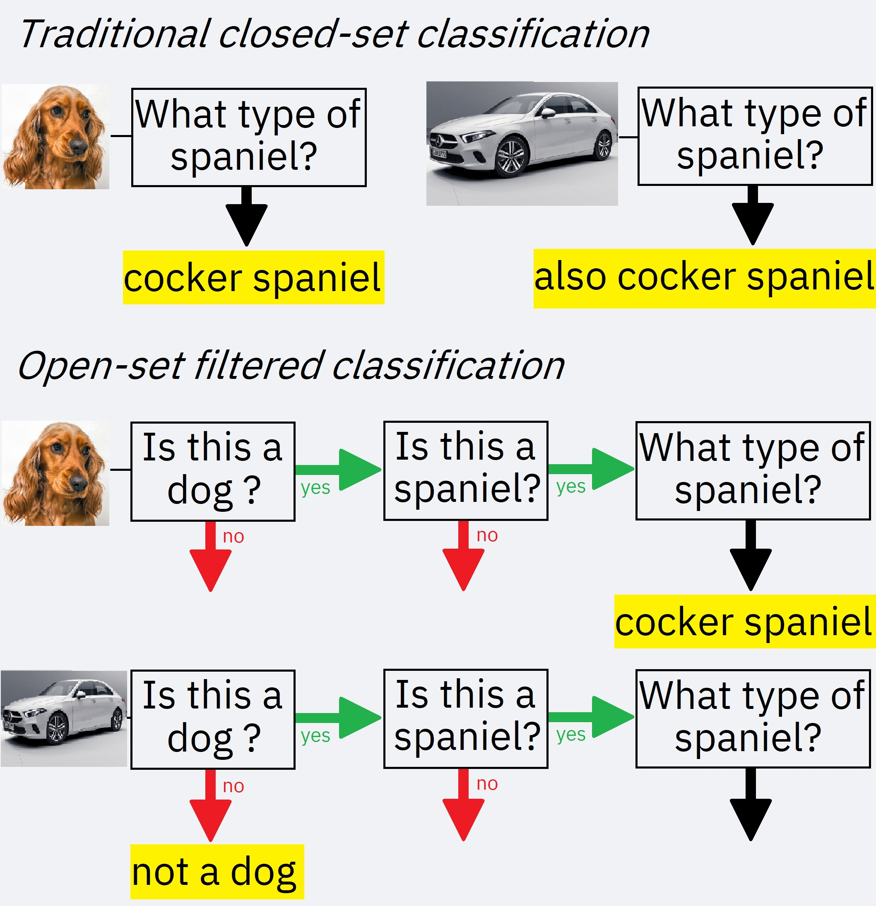

# Open set classification
Open-set classification is critical for letting image classifiers work in the real world. Source: https://github.com/Andrewwango/open-set-resnet

## Web app
Try me out here on Streamlit: https://andrewwango.github.io/open-set-resnet-web-app

The API is available here: https://open-set-resnet-api.herokuapp.com/ 

## Getting started locally
1.
        git clone https://github.com/Andrewwango/open-set-resnet.git
        cd open-set-resnet
        pip install -r requirements.txt
        cd python
2. Start API: `uvicorn api.src.main:app --reload`
3. Start Web app: `streamlit run web-app/src/web-app.py`
**OR**
3. Query the API using Swagger UI at `http://localhost:8000/docs`
**OR**
3. Call the inference function in Python (see )

        from api import open_set_inference as osi 
        osi.classify_open_set(image='test-images/animal.jpg')

## Introduction
A standard image classifier will assign a random image a category despite it not belonging to any specific category. These closed-set classifiers often do this with high confidence. An open-set classifier should detect images that do not belong in any of the classes. For example, a spaniels classifier should filter images of non-dogs and of non-spaniels; a car-model classifier should filter images of other makes or non-cars. 

Previous simple approaches include:
- Including out-of-distribution images in the training set and labelling them as "Other". Problem: this requires extensive coverage of potential "Other" images without imbalancing the datasets.
- Lump together all training images and pre-classify against a "outside world" image set. Problem: this also requires extensive coverage of potential "Other" images, as well as encountering the generality vs specificity dilemma: we need to filter out both specific non-spaniel dogs and random other objects such as cars.

This repo contains an example classifier which takes a spaniel/dog/Mercedes model classifier and adds open-set filtering capabilities. The classifier structure is as follows:

1. Classify image according to original ImageNet and reject if not car/dog-like (based on ImageNet labels).
2. Classify image according to 2-class "species" classifier trained on spaniels vs. non-spaniels/Mercedes vs. non-Mercedes, and reject if not spaniel/Mercedes.
3. Classify image according to original closed-set classifier (spaniel-breeds/Mercedes models).

All the models are based on the ResNet architecture and use PyTorch for training and inference:
1. Model 1: resnet18 with pretrained weights on ImageNet
2. Model 2: resnet18 pretrained, and then retrained to 2-class dataset (correct make/species vs. incorrect) using transfer learning.
3. Model 3: original pretrained and retrained resnet50 closed-set classifier. 

This is the equivalent of first asking a friend what a car is, then asking a friend what Mercedes is, then what the individual models are.

## Deployment
The open-set inference is developed as an API using FastAPI and uvicorn. This can be accessed using `requests.post`. You can test out different models on the Streamlit web-app. We deploy this repo as 2 separate apps on Heroku.

## Training
Model training can be done in the . To create a different open-set classifier, two models are needed:
1. Your original closed-set classifier.
2. Train another model with all the closed-set classes in one class, and images of different species but same thing in the other (e.g. non-Mercedes cars, or non-cow animals). To balance the sets, an augmentation script is provided . The augmentation performs a random rotation, a LR flipping, a random noise operation, Gaussian blur, a shear affine transformation and a contrast adjustment to produce 7 copies of the original image.

To set up another model,
1. Put images in training folder/AWS S3 bucket.
2. Run training notebook with correct training folder location.
3. Move models over to `api/src/models`
4. Add classifier to `api/src/classification.config` including model locations and label names.

## Datasets
- Cars: [Stanford](http://ai.stanford.edu/~jkrause/cars/car_dataset.html )
- Dogs: [Kaggle](https://www.kaggle.com/gpiosenka/70-dog-breedsimage-data-set)

## Literature
- Problem statement and possible practical solutions [here](https://towardsdatascience.com/does-a-neural-network-know-what-it-doesnt-know-c2b4517896d7)
- The literature also proposes methods which involve replacing the final SoftMax layer with a new layer e.g. [here](https://arxiv.org/abs/1511.06233), or changing the loss function to maximise distance between known classes and the unknown e.g. [here](https://arxiv.org/pdf/1811.04110v2.pdf) or [here](https://arxiv.org/pdf/1802.04365.pdf). These solutions are risky as they will probably impact the performance of the original closed-set classifier, which is undesirable.

## Further work
- Tuning the mercedes-non-mercedes model to improve the acceptance of mercedes at the cost of rejecting non-mercedes (reducing type II errors at the cost of accepting more type I errors).
- Improving inference time of mercedes cars, as they must go through 3 models for a prediction.
